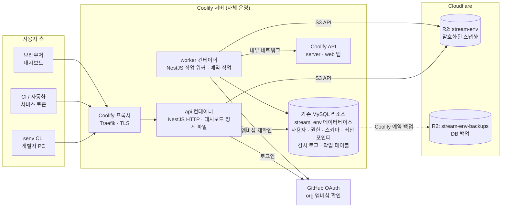
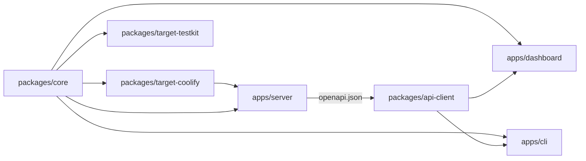
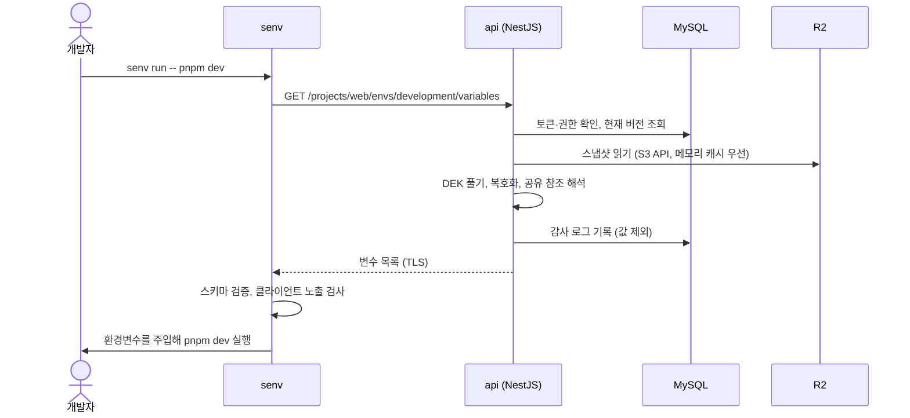
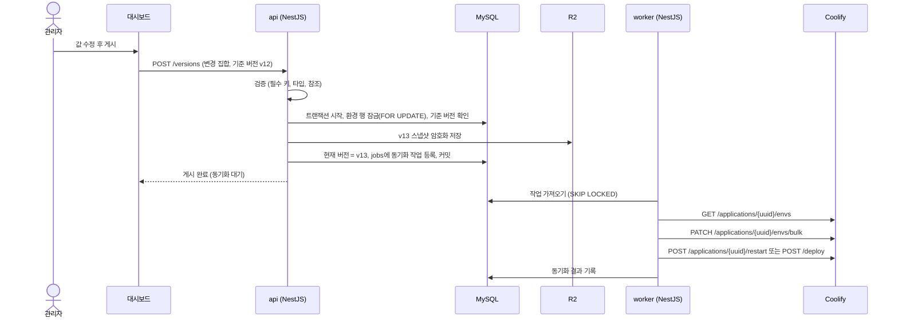
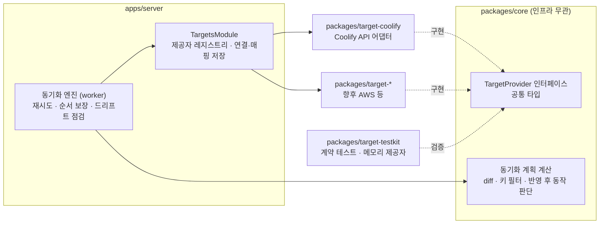

# Stream Env Control PRD

| 항목 | 내용 |
| --- | --- |
| 문서 상태 | v1.0 (결정사항 확정) |
| 작성일 | 2026-10-07 |
| 변경 이력 | v1.6: 대시보드 편집·표시·테스트 결정 추가 · v1.5: API 경로·CSRF·오류 형식, CLI 세부 결정 추가 · v1.4: 첫 관리자 지정, M1 권한 두 단계, 토큰 접두사, 세션 기간 확정 · v1.3: 환경을 local·development·production으로 고정, 공유 그룹은 특수 프로젝트, 이름 규칙 확정 · v1.2: NestJS 12(ESM 전용)에 맞춰 빌드·검증 스택 수정 · v1.1: 대시보드 디자인 시스템을 Primer로 확정 · v1.0: 결정사항 확정(14장), 배포 대상 제공자 추상화 추가 · v0.4: 로그인을 GitHub OAuth 하나로 고정, org 멤버십 기반 접근 제어 추가 · v0.3: 서버를 NestJS로, DB를 기존 MySQL 리소스로 변경, 모노레포 구조 추가 · v0.2: 인프라를 Coolify 자체 운영 + Cloudflare R2로 변경, 기술 스택 추가 |
| 대상 | Stream 서버·앱·웹 개발자, 배포 담당자 |

---

## 1. 개요

Stream Env Control은 Stream의 서버·앱·웹 환경변수를 Cloudflare R2에 암호화해 한곳에 두고, 개발자는 CLI로 내려받아 쓰며, 배포 서버(Coolify)에는 자동으로 반영하는 내부 도구다.

### 1.1 해결하려는 문제

- 환경변수가 Slack DM, Notion, 각자 노트북의 `.env` 파일에 흩어져 있어 어느 값이 최신인지 알기 어렵다.
- 서버·앱·웹 × local·development·production 조합마다 값이 달라서, 새 키를 추가하면 일부 환경에서 빠지기 쉽다.
- 새로 합류한 개발자는 동료에게 값을 하나씩 물어봐야 로컬 환경을 맞출 수 있다.
- Coolify에 값을 손으로 붙여넣다 보니 오타나 누락이 곧 배포 장애로 이어진다.
- 누가 언제 production 값을 보거나 바꿨는지 기록이 없다.

### 1.2 구성 요소

| 구성 요소 | 역할 | 주 사용자 |
| --- | --- | --- |
| CLI (`senv`) | 로그인, 환경별 변수 내려받기(`.env` 생성), 프로세스에 바로 주입해 실행 | 개발자, CI |
| 웹 대시보드 | 변수 편집과 게시, 환경별 누락 확인, 버전 관리와 롤백, 권한·감사 로그 | 관리자, 개발자 |
| 배포 대상 연동 | 배포 인프라와 매핑해 변수를 자동 반영하고 재시작·재배포. 첫 대상은 Coolify이고, 다른 인프라는 제공자 패키지를 추가해 붙인다 | 관리자 |

### 1.3 용어

| 용어 | 뜻 |
| --- | --- |
| 프로젝트 | 환경변수를 쓰는 배포 단위. 예: `server`, `app`, `web` |
| 환경 | `local`(개발자 PC), `development`(개발 서버), `production`(운영) 세 개로 고정된, 값이 달라지는 단위 |
| 게시(publish) | 편집한 내용을 확정해 새 버전 스냅샷을 만드는 동작 |
| 스냅샷 | 특정 프로젝트·환경의 전체 변수를 담은 불변 파일. R2에 암호화해 저장 |
| 키 스키마 | 프로젝트에 있어야 하는 키 목록과 타입·필수 여부·설명 |
| 드리프트 | 대시보드 값과 배포 대상(Coolify 등)에 실제 들어간 값이 달라진 상태 |
| 배포 대상 제공자 | Coolify, AWS 같은 인프라별 연동 구현. `core`의 공통 인터페이스를 따른다 |
| KEK / DEK | 마스터 키(Key Encryption Key) / 데이터 키(Data Encryption Key) |

---

## 2. 목표와 성공 지표

출시 후 1개월 안에 Stream의 모든 환경변수를 이 시스템으로 옮기고, 새 개발자가 5분 안에 로컬 환경을 갖추게 하는 것이 목표다.

### 2.1 목표

1. **단일 진실 원천**: 서버·앱·웹의 모든 환경, 모든 변수가 한곳에만 있다.
2. **개발자 셀프서비스**: 권한 범위 안에서는 누구에게도 묻지 않고 값을 받는다.
3. **배포 자동 반영**: 대시보드에서 바꾼 값이 손 작업 없이 Coolify에 들어간다.
4. **추적 가능성**: 모든 조회·변경·동기화에 누가, 언제, 무엇을 했는지 남는다.

### 2.2 비목표 (v1 범위 밖)

- 외부 고객에게 파는 범용 시크릿 매니저 (Doppler, Infisical 같은 제품)
- DB 비밀번호 자동 교체 같은 동적 시크릿
- Coolify 외 배포 대상(AWS 등)의 실제 구현. 단, 나중에 붙일 수 있도록 제공자 구조는 v1에서 만든다 (8.1).
- EAS 등 모바일 빌드 서비스 연동. 앱은 로컬·CI에서 `senv run`으로 빌드한다.
- 서비스 실행 중 값을 바꾸는 기능(feature flag, remote config)

### 2.3 성공 지표

| 지표 | 목표치 | 측정 방법 |
| --- | --- | --- |
| Slack·Notion에 남은 시크릿 사본 | 0건 (출시 1개월 후) | 수동 점검 |
| 신규 개발자 로컬 환경 구성 시간 | 5분 이내 | 온보딩 체크리스트 |
| 환경변수 누락·오타로 인한 배포 장애 | 분기당 0건 | 장애 기록 |
| 드리프트 상태인 Coolify 앱 | 0개 | 대시보드 동기화 상태 |
| 주간 CLI 사용 개발자 비율 | 90% 이상 | `pull`·`run` 감사 로그 |

---

## 3. 사용자와 핵심 시나리오

### 3.1 사용자

| 사용자 | 하는 일 | 기본 권한 |
| --- | --- | --- |
| 개발자 (서버·앱·웹) | 로컬 개발용 값 받기, 새 키 추가, local 값 수정 | local 쓰기, development 읽기 |
| 관리자 (리드, 배포 담당) | production 값 관리, 권한 부여, Coolify 연결 | 전체 |
| CI·자동화 | 빌드·테스트 시 값 주입 | 서비스 토큰에 지정한 프로젝트·환경 읽기 |

### 3.2 핵심 시나리오

1. **신규 개발자 온보딩**
    - 관리자가 대시보드에서 새 개발자의 GitHub 사용자명에 역할 템플릿(예: 개발자)을 미리 지정한다. 지정 없이 로그인한 org 멤버는 "승인 대기"로 남고 관리자가 승인한다.
    - 개발자는 `senv login`으로 브라우저에서 GitHub 로그인을 마친 뒤, `stream-web` 폴더에서 `senv pull`을 실행한다.
    - `.env.local`이 생성되고, 이 파일이 `.gitignore`에 들어 있는지 자동으로 확인한다.
2. **새 환경변수 추가**
    - 서버 개발자가 키 스키마에 `REDIS_URL`을 추가하고 development 값을 넣어 게시한다.
    - 대시보드 매트릭스에서 development·production 칸이 "누락"으로 표시되고, 관리자에게 알림이 간다.
    - 다른 개발자가 `senv run`을 실행하면 최신 버전이 바로 적용된다.
3. **production 값 변경과 배포**
    - 관리자가 production `PAYMENT_SECRET_KEY`를 수정하고, 변경 전후 diff를 확인한 뒤 게시한다.
    - 매핑된 Coolify 앱에 값이 반영되고, 설정에 따라 재시작 또는 재배포된다.
4. **잘못된 값 롤백**
    - 버전 기록에서 직전 버전을 골라 롤백한다. 롤백도 새 버전으로 기록되고 Coolify에 다시 반영된다.
5. **퇴사자 처리**
    - 멤버를 비활성화하면 그 사람의 CLI 토큰과 세션이 즉시 폐기된다. GitHub org에서 제거만 해도 다음 멤버십 확인(매일) 때 자동으로 비활성화된다.
    - 그 사람이 조회한 적 있는 시크릿 목록이 "교체 권장"으로 표시된다.

---

## 4. 시스템 구성과 기술 스택

Cloudflare에서는 R2만 쓴다. 서버는 NestJS로 만들어 Stream 서비스와 같은 Coolify 서버에 컨테이너로 올리고, 메타데이터는 Coolify에서 이미 운영 중인 MySQL 리소스에 전용 데이터베이스를 만들어 저장한다. 서버·대시보드·CLI는 이 저장소 하나에서 pnpm 모노레포로 관리한다. 개발자 PC와 CI에는 R2 접근 키를 주지 않고, 값의 암·복호화와 권한 확인은 서버만 한다.



### 4.1 구성 원칙

- **Cloudflare 의존은 R2 하나**: R2는 S3 호환 API로만 접근한다. 저장소 코드를 어댑터로 분리해 두면 나중에 MinIO나 AWS S3로 바꿀 수 있다. 로컬 개발도 MinIO로 한다.
- **기존 MySQL을 쓰되 격리한다**: 이미 운영 중인 MySQL 리소스에 `stream_env` 데이터베이스와 전용 계정을 만들고, 그 계정에는 `stream_env` 권한만 준다. 시크릿 평문은 DB에 없으므로(값은 R2에 암호화 저장) DB가 노출돼도 값은 드러나지 않는다.
- **비밀은 서버에만**: R2 키, KEK, OAuth 시크릿은 `api`·`worker` 컨테이너의 환경변수에만 있다.
- **Coolify API는 내부망으로**: 이 시스템이 Coolify와 같은 서버에 있으므로 Coolify API를 외부에 열 필요가 없다.
- **인프라 연동은 제공자 패키지로 분리**: Coolify 연동 코드는 `packages/target-coolify`에만 있고, 서버는 `core`의 공통 인터페이스만 쓴다. 다른 인프라는 제공자 패키지를 추가해 붙인다 (8.1).
- **자기 자신은 관리하지 않는다**: 이 시스템이 쓰는 환경변수(부트스트랩 시크릿)는 Coolify에 직접 넣는다. 자기 값을 자기에게서 받아오는 순환 의존을 피하기 위해서다.
- **R2 객체만으로 복구 가능**: 스냅샷마다 복호화에 필요한 감싼 DEK를 함께 저장해, 서버와 DB가 사라져도 R2와 KEK만 있으면 값을 되살릴 수 있다 (4.8).

### 4.2 기술 스택

**서버 (NestJS)**

| 영역 | 선택 | 고른 이유 |
| --- | --- | --- |
| 런타임 | Node.js 24 LTS | 장기 지원 버전. 대시보드·CLI와 언어를 맞춘다 |
| 프레임워크 | NestJS 12 (ESM, Express 어댑터) | 모듈·DI·Guard 구조가 권한 검사가 많은 이 서비스에 맞는다. Express는 Passport 등 생태계 호환이 가장 넓다 |
| 실행 구성 | `main.ts`(HTTP), `worker.ts`(`NestFactory.createApplicationContext`) | 같은 코드와 이미지로 API와 워커를 나눠 띄운다 |
| DB | 기존 MySQL 리소스 (MySQL 8.x), 전용 DB `stream_env` | 새 DB 리소스 없이 기존 운영·백업 체계를 쓴다 |
| ORM·마이그레이션 | Prisma | 스키마 파일 하나로 타입과 마이그레이션을 관리한다. 행 잠금이 필요한 두 곳(게시, 작업 가져오기)만 raw SQL을 쓴다 |
| 작업 큐 | MySQL `jobs` 테이블 + 폴링 워커 | Redis 없이 처리한다. `SELECT ... FOR UPDATE SKIP LOCKED`로 작업을 가져오고, 게시와 같은 트랜잭션에서 작업을 등록한다 (4.4) |
| 예약 작업 | @nestjs/schedule | 드리프트 점검, 감사 로그 내보내기. MySQL `GET_LOCK`으로 중복 실행을 막는다 |
| 입력 검증·DTO | Zod + NestJS 12의 Standard Schema 검증(`StandardSchemaValidationPipe`) | `packages/core`의 Zod 스키마를 라우트 검증에 그대로 써서, 서버·대시보드·CLI가 같은 검증 규칙을 공유한다. 별도 연동 패키지가 필요 없다 |
| API 문서·클라이언트 | @nestjs/swagger → `openapi.json` → openapi-typescript + openapi-fetch | 서버가 내보낸 OpenAPI 문서에서 대시보드·CLI용 타입 안전 클라이언트를 생성한다 |
| 인증 | @nestjs/passport + passport-github2 (GitHub OAuth만) + 자체 세션·토큰 | GitHub 로그인만 Passport에 맡긴다. org 멤버십 확인, 대시보드 세션, CLI 토큰, 서비스 토큰, 디바이스 인증(RFC 8628)은 직접 구현한다 |
| 권한 검사 | Nest Guard + 커스텀 데코레이터 | 예: `@RequireEnvPermission('write')`로 프로젝트 × 환경 권한을 확인한다 |
| R2 접근 | `@aws-sdk/client-s3` | R2의 S3 호환 API를 쓴다. 버킷 한정 API 토큰 사용 |
| 암호화 | Node.js 내장 `crypto` (AES-256-GCM) | 외부 의존 없이 봉투 암호화를 구현한다 |
| 배포 대상 연동 | `core`의 `TargetProvider` 인터페이스 + 제공자 패키지(`target-coolify`) | 인프라별 코드를 패키지로 분리해, 다른 인프라는 패키지 추가로 붙인다 (8.1) |
| 설정 | @nestjs/config + Zod | 부트스트랩 환경변수를 시작할 때 검증하고, 빠진 값이 있으면 기동하지 않는다 |
| 로그 | nestjs-pino | JSON 구조 로그. Coolify 로그 화면에서 바로 본다 |
| 헬스체크 | @nestjs/terminus | `/healthz`에서 MySQL·R2 연결을 확인한다 |
| 속도 제한 | @nestjs/throttler | 로그인, 디바이스 코드 확인, 토큰 발급 경로 |
| 대시보드 제공 | @nestjs/serve-static | 대시보드 빌드 결과를 같은 도메인에서 제공한다 |

인증에 Better Auth를 쓰지 않는 이유: NestJS 연동이 커뮤니티 패키지이고, 앱 전체의 body parser를 꺼야 한다. CLI 토큰과 서비스 토큰은 어차피 프로젝트 × 환경 범위를 담아 직접 만들어야 하므로, 토큰을 한 방식(불투명 랜덤 값을 SHA-256 해시로 저장)으로 통일한다. 그러면 DB에서 지우는 즉시 폐기된다.

**서버 모듈**

| 모듈 | 책임 |
| --- | --- |
| `AuthModule` | GitHub 로그인, org 멤버십 확인·재확인, 대시보드 세션, 디바이스 인증, CLI·서비스 토큰 발급과 폐기 |
| `MembersModule` | 승인 대기 처리, 역할 미리 지정, 역할 템플릿, 프로젝트 × 환경 권한 |
| `ProjectsModule` | 프로젝트, 환경, 공유 그룹 |
| `SchemaModule` | 키 스키마, 값 검증 |
| `VariablesModule` | 초안, 게시, 버전 조회, 롤백, 공유 참조 해석 |
| `CryptoModule` | KEK 로드, DEK 생성과 감싸기, 스냅샷 암·복호화 |
| `StorageModule` | R2 읽기·쓰기, 스냅샷 메모리 캐시 |
| `AuditModule` | 감사 로그 기록, 조회, R2 내보내기 |
| `TargetsModule` | 제공자 레지스트리, 연결·매핑 저장, 동기화 엔진, 드리프트 점검. 인프라별 코드는 없다 |
| `JobsModule` | `jobs` 테이블 등록, 가져오기, 재시도 (워커에서 실행) |
| `HealthModule` | `/healthz` |

**대시보드**

| 영역 | 선택 | 고른 이유 |
| --- | --- | --- |
| 빌드 | Vite + React (SPA) | 서버가 정적 파일로 같이 제공한다. 같은 도메인이라 쿠키 세션을 그대로 쓴다 |
| 라우팅 | TanStack Router | 타입 안전 라우팅 |
| 서버 상태 | TanStack Query + `packages/api-client` | 캐시, 재시도, 낙관적 업데이트 |
| 디자인 시스템 | Primer (`@primer/react`, `@primer/primitives`, `@primer/octicons-react`) | GitHub 로그인과 어울리는 GitHub 스타일 UI. 라이트·다크 테마와 접근성이 기본 제공된다. 별도 CSS 프레임워크 없이 Primer 컴포넌트와 디자인 토큰(CSS 변수)으로 스타일을 맞춘다 |
| 매트릭스 표 | Primer `DataTable` + TanStack Table(헤드리스) | 화면은 Primer로 그리고, 필터·정렬·고정 열 같은 표 로직만 TanStack Table에 맡긴다 |
| diff 표시 | `diff` (jsdiff) | 게시 전 변경 확인, 버전 비교 |

**CLI**

| 영역 | 선택 | 고른 이유 |
| --- | --- | --- |
| 언어 | TypeScript (Node.js 22 이상) | `packages/core`, `packages/api-client`를 그대로 쓴다 |
| 명령 파서 | commander | 하위 명령과 도움말 생성이 검증된 라이브러리 |
| 대화형 입력 | @clack/prompts | 프로젝트 선택, 쓰기 확인 프롬프트 |
| 토큰 저장 | @napi-rs/keyring | macOS Keychain, Windows Credential Manager, Linux Secret Service 지원. keytar 대체 |
| 배포 | GitHub Packages 비공개 npm 레지스트리 (`@billilge/senv`, 실행 명령 `senv`) | org 멤버만 설치할 수 있다. 설치에는 `read:packages` 권한 토큰과 `.npmrc` 설정이 필요하고, CI는 GitHub Actions 토큰으로 설치한다 |

**모노레포·개발 도구**

| 영역 | 선택 | 고른 이유 |
| --- | --- | --- |
| 모노레포 | pnpm workspaces + Turborepo | 패키지 간 의존 관리와 빌드 캐시. NestJS의 자체 모노레포 모드는 쓰지 않는다. 대시보드와 CLI가 Nest 앱이 아니어서, 서버도 워크스페이스 앱 하나로 둔다 |
| 공유 패키지 빌드 | tsup (ESM) | 서버(NestJS 12)·대시보드·CLI가 모두 ESM이다 |
| 서버 빌드 | `tsc` (ESM, `nodenext`) | Nest CLI 없이 빌드한다. Nest CLI 명령(generate 등)은 Node 24.15 이상이 필요하다 |
| 테스트 | Vitest(+ unplugin-swc), Testcontainers(MySQL), supertest, Playwright | 단위, DB 통합, API E2E, 대시보드 E2E. Nest의 데코레이터 메타데이터 때문에 서버 테스트는 SWC로 변환한다 |
| Coolify 계약 테스트 | 실제 응답을 녹화한 픽스처 | Coolify 버전이 바뀔 때 어댑터 회귀를 잡는다 |
| 로컬 개발 | `docker-compose.dev.yml`: MySQL 8, MinIO(R2 대용) | R2 없이 S3 호환 저장소로 개발한다 |
| 린트·포맷 | Biome | 린트와 포맷을 한 도구로 처리한다. 서버에서는 `useImportType` 규칙을 끈다. Nest DI가 런타임 타입 메타데이터를 쓰기 때문이다 |
| CI | GitHub Actions | 테스트, CLI를 GitHub Packages로 릴리즈 |
| 버전 관리 | Changesets | CLI 버전과 변경 기록 |
| 이미지 빌드 | `turbo prune server --docker` + 멀티 스테이지 Dockerfile | 서버에 필요한 패키지만 담아 이미지를 줄인다 |

### 4.3 모노레포 구조

```text
stream-env-control/
  apps/
    server/                  # NestJS
      src/
        main.ts              # HTTP 서버 진입점
        worker.ts            # 작업 워커 진입점
        modules/             # auth, members, projects, schema, variables,
                             # crypto, storage, audit, targets, jobs, health
      prisma/
        schema.prisma        # MySQL 스키마
        migrations/
      openapi.json           # 빌드 시 생성, 커밋 대상
    dashboard/               # Vite + React
    cli/                     # senv
  packages/
    core/                    # Zod 스키마, dotenv 파서·출력기, 권한·버전 공통 타입,
                             # 배포 대상 제공자 인터페이스와 동기화 계획 계산
    target-coolify/          # Coolify 제공자 (Coolify API 어댑터)
    target-testkit/          # 제공자 계약 테스트, 메모리 제공자
    api-client/              # openapi.json에서 생성한 타입 + fetch 클라이언트
    config/                  # 공유 tsconfig, Biome 설정
  Dockerfile                 # server 이미지 (dashboard 빌드 포함)
  docker-compose.yml         # Coolify 배포용: api, worker
  docker-compose.dev.yml     # 로컬 개발용: MySQL, MinIO
  pnpm-workspace.yaml
  turbo.json
  package.json
  PRD.md
```



- `api-client`는 서버가 내보낸 `openapi.json`에서 만든다. `openapi.json`을 커밋하므로 API가 바뀌면 PR diff에 그대로 드러난다.
- `dashboard` 빌드 결과는 서버 이미지에 함께 들어가 `@nestjs/serve-static`으로 제공된다.
- `target-*` 패키지는 `core`에만 의존한다. 서버는 제공자를 등록만 하고, 대시보드와 CLI는 제공자 패키지를 모른다.

### 4.4 MySQL 구성

| 항목 | 내용 |
| --- | --- |
| 데이터베이스 | 기존 MySQL 리소스 안에 `stream_env`를 만든다. 문자셋 `utf8mb4` |
| 계정 | `stream_env` 전용 계정. `stream_env.*` 권한만 준다 |
| 버전 | MySQL 8.x (확인됨). 작업 큐가 `SKIP LOCKED`를 쓴다 |
| 접속 | 앱이 MySQL 리소스와 같은 Coolify 네트워크에 있어야 내부 주소로 붙는다. 외부 포트는 열지 않는다 |
| 마이그레이션 | `api`가 시작할 때 `prisma migrate deploy`. `stream_env` 데이터베이스만 바꾼다 |
| 백업 | 기존 MySQL 리소스의 Coolify 예약 백업에 `stream_env`가 들어가는지 확인한다. 따로 보관해야 하면 R2 `stream-env-backups`로 보낸다 |

주요 테이블:

| 테이블 | 내용 |
| --- | --- |
| `users`, `sessions`, `github_accounts` | 사용자(GitHub 사용자 ID 기준), 대시보드 세션, GitHub 토큰(암호화) |
| `device_codes` | CLI 디바이스 로그인 대기 상태 |
| `api_tokens` | CLI 토큰과 서비스 토큰 (해시, 범위, 만료) |
| `projects`, `environments`, `shared_groups` | 프로젝트·환경·공유 그룹 |
| `key_schemas` | 키별 타입, 필수 여부, visibility, buildTime, 설명 |
| `env_versions` | 버전 메타데이터(번호, 작성자, 메시지, R2 객체 키)와 환경별 현재 버전 포인터 |
| `drafts` | 게시 전 초안 (암호화) |
| `permissions` | 사용자 × 프로젝트 × 환경 권한 |
| `audit_logs` | 감사 로그 |
| `target_connections`, `target_mappings`, `sync_runs` | 배포 대상 연결(제공자 종류, 암호화된 설정), 매핑(제공자 전용 옵션은 JSON), 동기화 기록 |
| `jobs` | 작업 큐 |

`jobs` 동작:

- 상태는 `pending` → `running` → `done` 또는 `failed`로 바뀐다.
- 워커는 2초마다 `status = 'pending' AND run_at <= NOW()`인 작업을 `FOR UPDATE SKIP LOCKED`로 가져온다. 워커가 여러 개여도 같은 작업을 두 번 잡지 않는다.
- 실패하면 `run_at`을 지수적으로 미뤄 3회까지 재시도한다.
- 같은 배포 대상 리소스에 대한 대기 작업은 하나만 남긴다. 더 새 버전이 들어오면 이전 대기 작업을 대체한다.
- 실행 중 워커가 죽으면 `locked_until`이 지난 `running` 작업을 다시 `pending`으로 돌린다.

### 4.5 Coolify 배포 구성

| Coolify 리소스 | 종류 | 내용 |
| --- | --- | --- |
| `stream-env-app` | Docker Compose (Git 연동) | `api`(도메인 연결, 대시보드 제공)와 `worker`. 같은 이미지에 실행 명령만 다르다 (`node dist/main.js`, `node dist/worker.js`) |
| 기존 MySQL 리소스 | MySQL | `stream_env` 데이터베이스와 전용 계정 추가 (4.4) |

- 도메인과 TLS는 Coolify 프록시(Traefik)와 Let's Encrypt로 처리한다. 도메인은 `senv.stream.billilge.site`다.
- `main` 브랜치에 푸시하면 Coolify가 이미지를 빌드해 배포한다.
- `GET /healthz`를 Coolify 헬스체크에 연결해, 비정상 컨테이너로 교체되지 않게 한다.
- `worker`는 1개만 띄운다. 예약 작업은 `GET_LOCK`으로 한 번 더 중복을 막는다.

**R2 버킷과 API 토큰**

| 버킷 | 쓰는 쪽 | 토큰 권한 |
| --- | --- | --- |
| `stream-env` | `api`, `worker` | Object Read & Write, 이 버킷만 |
| `stream-env-backups` | Coolify 예약 백업 (필요한 경우) | Object Read & Write, 이 버킷만 |
| `stream-env` | 비상 복구 담당 | Object Read, 이 버킷만. 평소에는 발급하지 않고 비상시에만 만든다 |

**부트스트랩 환경변수** (Coolify에 직접 입력, 이 시스템이 관리하지 않음)

| 변수 | 용도 |
| --- | --- |
| `DATABASE_URL` | `mysql://stream_env:<비밀번호>@<MySQL 내부 주소>:3306/stream_env` |
| `S3_ENDPOINT` | 운영은 `https://<account_id>.r2.cloudflarestorage.com`, 로컬은 MinIO 주소 |
| `S3_ACCESS_KEY_ID`, `S3_SECRET_ACCESS_KEY`, `S3_BUCKET` | 스냅샷 버킷 접근 |
| `SENV_KEK`, `SENV_KEK_ID` | 마스터 키(32바이트, base64)와 키 식별자 |
| `SESSION_SECRET` | 대시보드 세션 쿠키 서명 |
| `APP_URL` | 대시보드 기준 주소 `https://senv.stream.billilge.site`. OAuth 콜백 주소를 만들 때 쓴다 |
| `GITHUB_CLIENT_ID`, `GITHUB_CLIENT_SECRET` | GitHub OAuth App 자격 증명 |
| `GITHUB_ORG` | 로그인 기준이 되는 GitHub 조직 이름 (`billilge`) |
| `SENV_BOOTSTRAP_ADMINS` | 로그인하자마자 관리자가 되는 GitHub 사용자명 목록 (쉼표 구분). 첫 관리자를 정하는 데 쓴다 |

KEK를 잃으면 모든 스냅샷을 복구할 수 없다. 관리자 2명이 각자 비밀번호 관리자에 따로 보관해, Coolify 서버 밖에 최소 한 벌을 둔다.

### 4.6 흐름: 개발자가 값을 받아 실행



### 4.7 흐름: 게시와 Coolify 반영



- 버전 포인터 갱신과 작업 등록이 한 트랜잭션이라, 게시는 됐는데 동기화 작업이 빠지는 일이 없다.
- R2 저장 뒤 커밋이 실패하면 방금 쓴 v13 객체를 지운다. 지우기까지 실패해 남은 객체는 다음 게시가 같은 키로 덮어쓴다.

### 4.8 비상 복구

Coolify 서버나 MySQL이 사라져도 값은 R2에 남는다.

1. Cloudflare에서 `stream-env` 버킷 읽기 전용 토큰을 발급한다.
2. `senv recover`(숨김 명령)에 R2 토큰과 KEK를 넣어, 프로젝트·환경별로 버전 번호가 가장 큰 스냅샷을 복호화한다. DB 없이 동작한다.
3. MySQL의 `stream_env`를 백업으로 복원하고 시스템을 다시 배포한다. 백업 이후에 게시된 버전은 R2 스냅샷 목록과 비교해 현재 버전 포인터를 맞춘다.

---

## 5. 데이터 모델과 저장 구조

변수 값은 R2에 버전별 암호화 스냅샷으로, 사용자·권한·감사 로그 같은 메타데이터는 기존 MySQL 리소스의 `stream_env` 데이터베이스에 둔다.

### 5.1 계층 구조

- 조직(Stream) → 프로젝트(`server`, `app`, `web`) → 환경(`local`, `development`, `production`) → 변수
- **환경은 세 개로 고정**한다. 프로젝트를 만들면 세 환경이 함께 만들어지고, 환경을 추가하거나 지우는 기능은 없다.
- **이름 규칙**: 프로젝트 이름은 소문자·숫자·하이픈, 소문자나 숫자로 시작, 32자 이하 (예: `server`, `web-admin`). R2 저장 경로와 CLI 인자(`--project`, `--env`)에 그대로 쓴다. 화면 표시용 이름은 따로 둔다.
- **공유 그룹**: `kind='shared'`인 특수 프로젝트 하나로 둔다. 환경·버전·게시·권한 로직을 일반 프로젝트와 함께 쓴다. 여러 프로젝트가 같이 쓰는 값(예: `API_BASE_URL`, Sentry DSN)은 `shared` 그룹에 두고, 프로젝트에서는 `${shared.API_BASE_URL}`처럼 참조한다. 참조는 API가 응답할 때 해석한다.

### 5.2 변수 속성

`value`만 환경별로 다르고, 나머지 속성은 프로젝트 공통인 키 스키마에 속한다.

| 속성 | 범위 | 설명 | 예 |
| --- | --- | --- | --- |
| `key` | 스키마 | 대문자, 숫자, 밑줄 | `DATABASE_URL` |
| `value` | 환경별 | 값. 여러 줄 허용 | `postgres://...` |
| `visibility` | 스키마 | `secret`(마스킹, 조회 기록) 또는 `public`(클라이언트 번들에 들어가도 되는 값) | `secret` |
| `required` | 스키마 | 모든 환경에 있어야 하는지. 환경별 예외 지정 가능 | `true` |
| `type` | 스키마 | `string`, `url`, `number`, `boolean`, `json`. 게시·pull 때 검증 | `url` |
| `description` | 스키마 | 용도, 발급처, 담당자 | "production DB 접속 주소" |
| `buildTime` | 스키마 | 빌드 시점에 필요한 값인지. Coolify 반영과 재배포 판단에 사용 | `false` |

### 5.3 R2 객체 구조

```text
stream-env/                                   # R2 버킷 (값)
  projects/{project}/{env}/v{n}.json.enc      # 불변 스냅샷 (게시할 때마다 n+1)
  shared/{env}/v{n}.json.enc                  # 공유 그룹 스냅샷
  audit/{yyyy}/{mm}/{dd}.jsonl                # 감사 로그 일 단위 내보내기

stream-env-backups/                           # R2 버킷 (Coolify 예약 백업)
  ...                                         # MySQL 덤프 (따로 보관할 때). 경로는 Coolify가 정한다
```

스냅샷 객체 형식 (R2에 저장되는 모양):

```json
{
  "format": 1,
  "kekId": "kek-2026-10",
  "wrappedDek": "base64(iv + 감싼 DEK + tag)",
  "iv": "base64...",
  "ciphertext": "base64...",
  "tag": "base64..."
}
```

스냅샷 평문 형식 (`ciphertext`를 풀었을 때):

```json
{
  "project": "server",
  "env": "production",
  "version": 13,
  "createdAt": "2026-10-07T09:00:00Z",
  "createdBy": "user_123",
  "message": "결제 키 교체",
  "variables": { "DATABASE_URL": "postgres://...", "PAYMENT_SECRET_KEY": "..." }
}
```

### 5.4 버전 규칙

- 게시할 때마다 환경 전체를 담은 새 스냅샷을 만든다. 기존 스냅샷은 수정하거나 지우지 않는다.
- 현재 버전 포인터는 MySQL에 둔다. 롤백은 과거 스냅샷 내용을 그대로 새 버전으로 게시하는 방식이다.
- 게시 요청에는 기준 버전을 함께 보낸다. 그 사이 다른 사람이 게시했다면 `409 Conflict`를 돌려주고 diff를 다시 보여준다.
- 대시보드의 편집 중인 초안과 Coolify API 토큰도 같은 방식으로 암호화해 MySQL에 저장한다.

### 5.5 암호화

- **봉투 암호화**: 스냅샷마다 새 DEK를 만들어 AES-256-GCM으로 암호화하고, DEK는 KEK로 감싸 스냅샷 객체에 함께 저장한다.
- 그래서 R2 객체 하나와 KEK만 있으면 복호화할 수 있다. DB가 없어도 복구된다 (4.8).
- KEK는 `api`·`worker` 컨테이너의 환경변수에만 있다. R2 버킷이나 DB 백업 하나만 유출돼서는 값을 읽을 수 없다.
- 복호화는 API 서버에서만 하고, 권한이 확인된 요청에만 TLS로 평문을 돌려준다.
- KEK를 교체할 때는 각 스냅샷의 DEK만 새 KEK로 다시 감싸 객체를 새로 쓴다. 값 본문은 복호화하지 않는다. `kekId`로 어느 KEK를 쓸지 구분하므로 교체 중에도 두 KEK를 함께 쓸 수 있다.

---

## 6. 기능 요구사항: CLI

개발자는 파일을 남기지 않는 `senv run`을 기본으로 쓰고, `.env` 파일이 꼭 필요한 도구에만 `senv pull`을 쓴다.

### 6.1 설정 파일

저장소 루트(모노레포라면 패키지 폴더)의 `senv.json`. 값은 들어 있지 않으므로 커밋한다.

```json
{
  "project": "web",
  "defaultEnv": "local",
  "output": ".env.local",
  "format": "dotenv"
}
```

### 6.2 명령어

| 명령 | 동작 | 단계 |
| --- | --- | --- |
| `senv login` | 브라우저 기반 디바이스 로그인. 토큰은 OS 키체인에 저장 | M1 |
| `senv logout` | 로컬 토큰 삭제, 서버 쪽 토큰 폐기 | M1 |
| `senv init` | 프로젝트를 고르면 `senv.json` 생성, 출력 파일을 `.gitignore`에 추가 | M1 |
| `senv pull [--env <env>]` | 최신 버전을 받아 `.env` 파일로 저장 | M1 |
| `senv run [--env <env>] -- <cmd>` | 파일 없이 환경변수를 주입해 명령 실행 | M1 |
| `senv list` / `senv get <KEY>` | 키 목록(값 마스킹) / 단일 값 조회 | M1 |
| `senv status` | 로컬 파일 버전과 원격 최신 버전 비교 | M2 |
| `senv diff` | 로컬 `.env`와 원격 값의 차이(추가·변경·삭제) | M2 |
| `senv set <KEY>=<VALUE> [--env <env>]` | 값 수정 후 새 버전 게시 (쓰기 권한 필요) | M2 |
| `senv push [--file <path>]` | 로컬 `.env`를 diff 확인 후 일괄 반영. 기존 파일 이관에 사용 | M2 |
| `senv export --format <dotenv\|json\|shell\|yaml>` | 원하는 형식으로 표준 출력 | M2 |
| `senv doctor` | `.gitignore` 등록, 필수 키 누락, 타입 오류, 시크릿의 공개 접두사 사용 점검 | M2 |
| `senv sync --target <연결 이름>` | 배포 대상 반영을 로컬·CI에서 실행 (서버에서 닿지 않는 인프라용) | M4 |

### 6.3 요구사항

- **비대화형 모드**: `SENV_TOKEN` 환경변수가 있으면 서비스 토큰으로 인증하고 프롬프트를 띄우지 않는다. CI에서 쓴다.
- **쓰기 확인**: `set`, `push`는 diff를 보여주고 확인을 받는다. production 쓰기는 `--env production`을 명시하고 프로젝트 이름을 다시 입력해야 한다.
- **버전 표시**: `pull`로 만든 파일 첫 줄에 버전과 생성 시각을 주석으로 남긴다. `status`와 `diff`는 이 값을 기준으로 비교한다.
- **최신 여부 안내**: `run` 실행 시 로컬에서 마지막으로 쓴 버전보다 새 버전이 있으면 변경된 키 이름을 한 줄로 알려준다.
- **클라이언트 노출 검사**: 앱(Expo)은 `EXPO_PUBLIC_`, 웹(Vite)은 `VITE_`가 붙은 값이 번들에 들어간다. 이 접두사를 쓴 변수가 `secret`이면 pull·run을 멈추고 경고한다. 스키마에 등록되지 않은 키는 막지 않고 경고만 한다. 접두사 목록은 프로젝트 설정에 저장한다.
- **개인 덮어쓰기 (M2)**: `.env.local.override` 파일이 있으면 `run`·`pull`이 받은 값 위에 덮어쓴다. 개인 DB 포트 같은 값에 쓴다. 이 파일은 `.gitignore`에 있어야 하고, `doctor`가 확인한다. production 환경에서는 적용하지 않는다.
- **앱 빌드**: 앱은 로컬이나 CI에서 직접 빌드한다(EAS 연동 없음). CI에서는 서비스 토큰으로 `senv run --env production -- <빌드 명령>`을 실행한다.
- **파일 보호**: `pull`로 만든 파일은 권한 600으로 쓴다. 출력 파일이 `.gitignore`에 없으면 경고 후 중단하고, `--force`로만 넘어갈 수 있다.
- **배포**: GitHub Packages 비공개 npm 패키지(`@billilge/senv`). 실행 명령은 `senv`이고 Node.js 22 이상이 필요하다. Node 없이 쓰는 단일 바이너리는 필요해지면 검토한다.
- **오류 안내**: 권한 없음, 토큰 만료, 네트워크 오류, 스키마 위반을 구분하고 다음에 할 일을 알려준다.

---

## 7. 기능 요구사항: 웹 대시보드

대시보드의 중심 화면은 "키 × 환경" 매트릭스다. 어느 환경에 어떤 키가 빠졌는지 한눈에 보고, 그 자리에서 편집해 게시한다.

### 7.1 화면

| 화면 | 주요 기능 | 단계 |
| --- | --- | --- |
| 로그인·승인 | GitHub 로그인(org 멤버만), 승인 대기 목록, GitHub 사용자명으로 역할 미리 지정 | M1 |
| 프로젝트 목록 | 프로젝트별 환경 수, 최근 게시, 누락 키 수, Coolify 동기화 상태 | M1 |
| 변수 매트릭스 | 행은 키, 열은 환경. 칸 상태는 설정됨·누락·다른 환경과 같음. 값은 마스킹 | M1 |
| 편집·게시 | 셀 편집, `.env` 붙여넣기 일괄 입력, diff 확인 후 메시지와 함께 게시 | M1 |
| 버전 기록 | 버전 목록, 두 버전 비교, 롤백 | M2 |
| 키 스키마 | 키별 타입·필수·visibility·buildTime·설명 관리 | M2 |
| 멤버·권한 | 프로젝트 × 환경 단위 권한, 만료일, 비활성화 | M2 |
| 서비스 토큰 | CI·자동화용 토큰 발급, 범위·만료 지정, 폐기 | M2 |
| 감사 로그 | 이벤트 필터·검색, CSV 내보내기 | M2 |
| 배포 대상 연동 | 제공자 선택, 연결 관리, 매핑, 동기화 기록, 드리프트 처리. 폼은 제공자가 내준 스키마로 그린다 (8장) | M3 |

### 7.2 요구사항

- **값 표시**: `secret` 값은 기본으로 가린다. "보기"를 누르면 30초 동안 보이고 감사 로그에 남는다. 읽기 권한이 없는 환경은 키 이름과 설정 여부만 보인다.
- **게시 전 검증**: 필수 키 누락, 타입 오류, 끊긴 공유 참조가 있으면 게시 버튼을 막고 이유를 보여준다.
- **환경 간 복사**: 선택한 키를 다른 환경으로 복사한다(예: development → production). 복사 전 값 diff를 보여준다.
- **일괄 입력**: 기존 `.env` 파일 내용을 붙여넣으면 파싱해서 추가·변경·삭제 후보로 나눠 보여준다. 이관 작업에 쓴다.
- **동시 편집**: 게시 시점에 기준 버전이 바뀌었으면 충돌을 알리고 최신 버전 기준으로 diff를 다시 보여준다.
- **알림 (M4)**: 게시, 누락 키, 동기화 실패, 드리프트를 Slack 채널로 보낸다.

---

## 8. 기능 요구사항: 배포 대상 연동

게시한 값을 실제 배포 인프라에 반영하는 기능이다. 인프라별 코드는 "배포 대상 제공자(target provider)" 패키지로 분리하고, 서버와 대시보드는 `packages/core`에 정의한 공통 인터페이스만 안다. v1의 제공자는 Coolify 하나다. AWS 같은 다른 인프라는 같은 인터페이스를 구현한 패키지를 추가해 붙이며, 서버·대시보드·DB 스키마는 바꾸지 않는다.

### 8.1 배포 대상 추상화

**용어**

| 용어 | 뜻 | Coolify | AWS (예시, 구현 범위 아님) |
| --- | --- | --- | --- |
| 제공자 (provider) | 인프라 종류별 구현 패키지 | `packages/target-coolify` | `packages/target-aws` |
| 연결 (connection) | 인프라에 접속하는 설정과 자격 증명 | 인스턴스 URL + API 토큰 | 리전 + IAM 자격 증명 |
| 리소스 (resource) | 값을 넣을 대상 하나 | Application | ECS 서비스, Parameter Store 경로 |
| 매핑 (mapping) | (Stream 프로젝트, 환경) → 리소스 1개 이상과 옵션 | `server/production` → `stream-api-prod` | `server/production` → `stream-api` 서비스 |

**구조**



**책임 나누기**

| 위치 | 맡는 일 | 인프라 지식 |
| --- | --- | --- |
| `packages/core` | `TargetProvider` 인터페이스, 공통 타입(리소스, 원격 변수, 동기화 계획), diff·키 필터·반영 후 동작 판단 같은 순수 로직 | 없음 |
| `packages/target-<이름>` | 연결 확인, 리소스 목록, 원격 값 읽기·쓰기, 재시작·재배포. 공통 속성을 인프라 필드로 변환 | 해당 인프라만 |
| `apps/server`의 `TargetsModule` | 제공자 등록, 연결·매핑 저장(자격 증명 암호화), 작업 큐 연결, 재시도·순서 보장, 드리프트 점검 일정, 감사 로그 | 없음 |
| `apps/dashboard` | 제공자가 내준 스키마로 연결·매핑 폼을 그린다 | 없음 |
| `packages/target-testkit` | 모든 제공자가 통과해야 하는 계약 테스트, 테스트용 메모리 제공자 | 없음 |

**제공자 인터페이스 (초안)**

```ts
// packages/core/src/targets/provider.ts
export interface TargetProvider<Conn = unknown, Opts = unknown> {
  type: string;                         // 'coolify'
  displayName: string;
  capabilities: TargetCapabilities;
  connectionSchema: ZodType<Conn>;      // 연결 폼과 저장 형식. 비밀 필드는 메타데이터로 표시
  mappingOptionsSchema: ZodType<Opts>;  // 제공자 전용 매핑 옵션

  testConnection(conn: Conn): Promise<void>;
  listResources(conn: Conn): Promise<TargetResource[]>;
  readVariables(conn: Conn, resource: ResourceRef): Promise<RemoteVariable[]>;
  applyPlan(conn: Conn, resource: ResourceRef, plan: SyncPlan, opts: Opts): Promise<ApplyResult>;
  runAction?(conn: Conn, resource: ResourceRef, action: 'restart' | 'redeploy'): Promise<ActionResult>;
}

export interface TargetCapabilities {
  readValues: boolean;                  // 원격 값을 읽을 수 있나 (드리프트 감지, 초기 가져오기)
  deleteKeys: boolean;                  // 관리 밖 키를 지울 수 있나
  actions: Array<'restart' | 'redeploy'>;
  buildTimeFlag: boolean;               // 빌드 시점 변수를 따로 표시할 수 있나
}

// 제공자에게 넘기는 값은 인프라와 무관한 공통 속성만 담는다
export interface DesiredVariable {
  key: string;
  value: string;
  buildTime: boolean;
  multiline: boolean;
}
```

**설계 규칙**

- 제공자는 "한 번 호출"만 책임진다. 재시도, 순서 보장, 멱등성, 결과 기록, 감사 로그는 엔진이 맡는다.
- 제공자는 자격 증명을 저장하지 않는다. 엔진이 `target_connections`에서 복호화해 호출할 때마다 넘긴다.
- 인프라마다 다른 기능은 `capabilities`로 표현한다. 엔진과 대시보드는 이 값을 보고 기능을 켜고 끈다. 예: `readValues`가 없으면 드리프트 감지와 초기 가져오기를 숨긴다.
- 인프라 전용 개념(Coolify의 preview 배포, `is_literal`)은 공통 타입에 넣지 않고 그 제공자의 `mappingOptionsSchema`에만 둔다.
- 추상화가 Coolify 모양으로 굳지 않도록, 엔진과 대시보드 테스트는 `target-testkit`의 메모리 제공자로 돌린다. Coolify 없이도 전체 흐름이 동작해야 한다.

**새 제공자 추가 절차**

1. `packages/target-<이름>`을 만들고 `TargetProvider`를 구현한다. 의존은 `packages/core`만 허용한다.
2. `packages/target-testkit`의 계약 테스트를 통과시킨다. 실제 인프라 대신 녹화한 응답이나 샌드박스 계정을 쓴다.
3. `apps/server`의 `TargetsModule`에 등록한다. 대시보드, DB 스키마, API는 바꾸지 않는다.
4. 패키지 `README.md`에 속성 대응표, 지원 기능(`capabilities`), 제약을 적는다.

### 8.2 공통 동기화 절차

모든 제공자에 똑같이 적용된다.

1. 엔진이 매핑의 연결 설정을 복호화하고, 연결의 제공자 종류로 레지스트리에서 제공자를 찾는다.
2. 제공자가 원격 값을 읽는다 (`readVariables`, `readValues` 지원 시).
3. `core`가 동기화 계획을 계산한다: 추가·변경·삭제·변경 없음. 원격 값을 읽을 수 없는 제공자는 마지막 동기화 기록의 해시와 비교해 바뀐 키만 쓴다. 수동 모드면 계획을 보여주고 확인을 받는다.
4. 제공자가 계획을 반영한다 (`applyPlan`).
5. 반영 후 동작을 실행한다 (`runAction`). 자동 판단은 바뀐 키에 `buildTime` 값이 있으면 재배포, 없으면 재시작이다. 제공자가 지원하지 않는 동작은 고를 수 없다.
6. 결과를 `sync_runs`에 기록한다: Stream 버전, 리소스, 바뀐 키 이름(값 제외), 성공·실패, 제공자가 돌려준 참조(예: Coolify `deployment_uuid`).

**공통 매핑 옵션**

| 옵션 | 기본값 | 설명 |
| --- | --- | --- |
| 동기화 방식 | 게시 시 자동 | 자동 / 수동(diff 확인 후 버튼). 게시할 때 이미 diff를 확인하므로 자동을 기본으로 한다 |
| 반영 후 동작 | 자동 판단 | 없음 / 재시작 / 재배포 / 자동 판단. 제공자의 `actions`에 있는 것만 보인다 |
| 관리 밖 키 | 유지 | 유지 / 삭제. 제공자가 `deleteKeys`를 지원할 때만 보인다 |
| 키 필터 | 전체 | 포함·제외 패턴 (예: `SENTRY_*` 제외) |

- **재시도**: 실패하면 지수 백오프로 3회 재시도한다. 끝내 실패하면 대시보드 배너로 알리고 리소스 단위로 상태를 보여준다.
- **멱등성**: 같은 버전을 여러 번 동기화해도 결과가 같다. 바뀐 값이 없으면 재시작도 하지 않는다.
- **순서 보장**: 같은 리소스에 대한 동기화는 한 번에 하나만 실행한다. 대기 중에 더 새 버전이 게시되면 이전 작업은 건너뛴다.

### 8.3 드리프트 감지

- `readValues`를 지원하는 제공자에만 적용된다.
- `worker`의 예약 작업(@nestjs/schedule)으로 1시간마다 원격 값을 읽어 마지막으로 동기화한 값과 비교한다. 비교는 값 해시로 하고 값 자체는 기록하지 않는다.
- 인프라 쪽에서 누군가 직접 고친 키는 "드리프트"로 표시하고, 두 가지 처리 중 하나를 고르게 한다.
    - 대시보드 값으로 덮어쓰기
    - 원격 값을 가져와 새 버전으로 게시

### 8.4 초기 가져오기

- `readValues`를 지원하는 제공자에만 적용된다.
- 처음 매핑할 때 인프라에 이미 들어 있는 변수를 가져와 해당 환경의 첫 버전으로 만들 수 있다. 기존 값을 옮기는 출발점이다.
- 가져온 키는 기본으로 `secret`, `required: true`로 등록하고 관리자가 스키마를 다듬는다.

### 8.5 Coolify 제공자 (`target-coolify`)

**연결 설정**

| 입력값 | 설명 |
| --- | --- |
| 연결 이름 | 예: `coolify-main` |
| 인스턴스 URL | Coolify 주소. API는 `{URL}/api/v1`. 이 시스템과 같은 서버의 Coolify는 내부 주소를 쓴다 |
| API 토큰 (비밀 필드) | Coolify의 `Keys & Tokens > API tokens`에서 발급한 토큰 |

- `testConnection`은 `GET /api/v1/applications`를 호출해 토큰이 유효한지, 앱 목록을 읽을 수 있는지 확인한다.
- 토큰은 KEK로 암호화해 저장하고 이후 화면에 다시 보여주지 않는다. 교체만 가능하다.
- Coolify 인스턴스를 여러 개 등록할 수 있다.

**지원 기능과 API 대응**

| 인터페이스 | Coolify API |
| --- | --- |
| `testConnection`, `listResources` | `GET /applications` (리소스 = Application: 이름, Coolify 프로젝트·환경, UUID) |
| `readVariables` | `GET /applications/{uuid}/envs` |
| `applyPlan` | 추가·변경은 `PATCH /applications/{uuid}/envs/bulk`로 한 번에, 삭제는 키별 env 삭제 API |
| `runAction('restart')` | `POST /applications/{uuid}/restart` |
| `runAction('redeploy')` | `POST /deploy?uuid={uuid}` |
| `capabilities` | `readValues`, `deleteKeys`, `restart`·`redeploy`, `buildTimeFlag` 모두 지원 |

**속성 대응**

| 공통 속성 | Coolify 필드 |
| --- | --- |
| `buildTime: true` | `is_buildtime` |
| `buildTime: false` (기본) | `is_runtime` |
| `multiline: true` | `is_multiline` |
| (제공자 고정) 값의 `$`를 치환하지 않음 | `is_literal` 켬 |
| (Coolify 전용 매핑 옵션) Preview 배포 반영 | `is_preview` |

**Coolify 전용 매핑 옵션**

| 옵션 | 기본값 | 설명 |
| --- | --- | --- |
| Preview 배포 반영 | 끔 | 켜면 preview 배포용 변수로도 넣는다 |

**프로젝트별 참고**

- `server`: 런타임 값이 대부분이라 반영 후 재시작으로 충분하다.
- `web`(Vite SPA): 값이 빌드할 때 번들에 들어가므로 모든 키를 `buildTime: true`로 둔다. 그래서 반영 후 항상 재배포된다.
- `app`(Expo): Coolify에 배포하지 않으므로 매핑하지 않는다. 앱 빌드는 6.3을 따른다.

**범위와 제약**

- v1은 Coolify **Application**만 지원한다. docker compose 기반 **Service**는 M4에서 지원한다.
- `worker`는 같은 서버의 Coolify API를 내부 네트워크로 호출하므로 Coolify API를 외부에 열 필요가 없다. 실제 호출 주소(Docker 네트워크의 Coolify 컨테이너 또는 호스트 주소)는 구현 시 서버 구성으로 확인한다.
- Coolify 버전에 따라 필드 이름과 HTTP 메서드가 다를 수 있다. 구현 전에 실제 인스턴스 버전으로 확인하고, 녹화한 응답으로 계약 테스트를 만든다.

### 8.6 다른 인프라를 붙일 때 (설계 검증용 예시)

AWS는 지금 구현하지 않는다. 다만 인터페이스가 Coolify 밖에서도 성립하는지 확인하려고 대응 관계만 적어 둔다.

| 인터페이스 | AWS에서 대응하는 것 (예시) |
| --- | --- |
| 연결 | 리전 + IAM 자격 증명(액세스 키 또는 역할) |
| 리소스 | ECS 서비스(태스크 정의의 환경변수·secrets) 또는 Parameter Store 경로 |
| `readValues` | 지원 (태스크 정의, 파라미터 조회) |
| `applyPlan` | 새 태스크 정의 등록, 또는 파라미터 일괄 쓰기 |
| `actions` | `redeploy`만 (서비스를 새 태스크 정의로 갱신) |
| `buildTimeFlag` | 없음 (런타임 값만) |

이 표에서 공통 인터페이스로 표현이 안 되는 것이 나오면, 인터페이스를 바꾸기 전에 `capabilities`나 제공자 전용 옵션으로 풀 수 있는지 먼저 본다.

---

## 9. 보안, 권한, 감사

### 9.1 원칙

- R2 접근 키, KEK, OAuth 시크릿은 `api`·`worker` 컨테이너의 환경변수에만 있다. 개발자·CI는 API로만 값을 받는다.
- 값은 저장 시 앱 수준에서 한 번 더 암호화한다 (5.5).
- 감사 로그에는 값을 남기지 않는다. 키 이름, 버전, 사용자, 시각, 기기, IP만 남긴다.
- **위협 범위**: R2 버킷이나 DB 백업 하나만 유출되면 값은 안전하다. 하지만 Coolify 서버의 root 권한을 빼앗기면 KEK, DB, R2 키가 함께 노출된다. 그래서 서버 접근 통제가 가장 중요한 방어선이다: SSH 키 전용 로그인, 접속 가능한 관리자 최소화, Coolify 관리자 계정 2FA.
- **외부 노출**: Cloudflare 프록시를 쓰지 않으므로 대시보드와 API가 인터넷에 직접 열린다. 로그인, 디바이스 코드 확인, 토큰 발급 경로에 속도 제한을 걸고, 필요하면 Coolify 프록시에서 대시보드 경로에 IP 허용 목록을 건다.

### 9.2 인증

| 대상 | 방식 |
| --- | --- |
| 대시보드 | GitHub OAuth 로그인만 허용 (Passport). 세션은 MySQL에 저장하고 httpOnly 쿠키로 전달. 마지막 사용 후 7일이 지나면 만료되고, 쓸 때마다 연장한다 |
| CLI | 직접 구현한 디바이스 인증 흐름(RFC 8628). 브라우저에서 GitHub로 로그인한 뒤 사용자 코드를 승인한다. 토큰은 불투명 랜덤 값이고 서버에는 해시만 저장한다. access 토큰 1시간, refresh 토큰 30일(쓸 때마다 새로 발급하고, 이미 쓴 refresh 토큰이 다시 오면 그 사용자의 토큰을 모두 폐기). 토큰에는 종류를 알 수 있는 접두사를 붙인다: `senv_at_`(access), `senv_rt_`(refresh), `senv_st_`(서비스 토큰). 코드나 로그에 새어 나가도 시크릿 스캐닝 도구로 찾을 수 있다. macOS Keychain, Windows Credential Manager, Linux libsecret에 저장 |
| 서비스 토큰 | 프로젝트·환경·읽기/쓰기 범위 지정, 만료일 필수(최대 1년). 발급 시 한 번만 보여주고 해시로 저장 |

**GitHub 로그인 정책**

- 로그인 수단은 GitHub OAuth 하나뿐이다. 이메일·비밀번호 로그인이나 다른 소셜 로그인은 만들지 않는다.
- 사용자는 GitHub 사용자 ID(숫자)로 식별한다. 사용자명은 바뀔 수 있어 표시용으로만 쓴다.
- 요청 권한(scope)은 `read:user`, `read:org`다.
- 로그인은 `GITHUB_ORG` 조직(`billilge`)의 활성 멤버만 할 수 있다 (`GET /user/memberships/orgs/{org}` 응답의 `state`가 `active`). org 밖 인원(외주 등)은 받지 않는다.
- 로그인만으로는 권한이 생기지 않는다. 역할이 미리 지정되지 않은 멤버는 "승인 대기"로 남고, 관리자가 역할 템플릿을 주면 쓸 수 있다.
- **멤버십 재확인**: 로그인 때 받은 GitHub 토큰을 KEK로 암호화해 저장하고, `worker`가 매일 활성 사용자의 org 멤버십을 다시 확인한다.
    - org에서 빠졌으면 계정을 비활성화하고 세션과 CLI 토큰을 폐기한다.
    - 사용자가 GitHub에서 앱 권한을 철회해 확인할 수 없으면 세션과 CLI 토큰을 폐기하고 다시 로그인하게 한다.
    - GitHub 장애(5xx, 네트워크 오류)일 때는 아무것도 바꾸지 않고 다음 주기에 다시 확인한다.
- **org 쪽 설정**: 새 org는 OAuth App 접근 제한이 기본으로 켜져 있어, org 소유자가 이 앱을 승인해야 멤버십을 읽을 수 있다. GitHub 계정이 곧 이 시스템의 열쇠이므로 org에 2단계 인증 필수 설정을 켠다.

### 9.3 권한

**M1**에서는 두 단계만 둔다: 승인된 멤버는 모든 프로젝트·환경을 읽고 쓰고, 관리자는 사용자 승인과 비활성화도 한다. M1의 목표가 local·development 값 이관이고 production 값 이관은 M2 완료 기준이라, 아래 세부 권한은 M2에서 넣는다.

**M2부터** 권한은 프로젝트 × 환경 단위로 `none`, `read`, `write`, `admin` 중 하나를 준다.

| 권한 | 할 수 있는 일 |
| --- | --- |
| `none` | 키 이름과 설정 여부만 보기 |
| `read` | 값 보기, `pull`, `run` |
| `write` | `read` + 편집, 게시 |
| `admin` | `write` + 롤백, 멤버 권한, Coolify 매핑, 서비스 토큰 |

역할 템플릿 (승인하거나 미리 지정할 때 고른다):

| 템플릿 | local | development | production |
| --- | --- | --- | --- |
| 관리자 | admin | admin | admin |
| 시니어 개발자 | write | write | read |
| 개발자 | write | read | none |
| 읽기 전용 | read | none | none |

### 9.4 감사 로그

| 이벤트 | 기록 내용 |
| --- | --- |
| 로그인·로그아웃 | GitHub 사용자 ID·사용자명, 수단(대시보드/CLI), IP, 기기 |
| 멤버십 확인 | 확인 결과(활성·제거·확인 불가), 자동 비활성화 여부 |
| 값 조회 (`pull`, `run`, 대시보드 보기) | 프로젝트, 환경, 버전, 조회한 키(대시보드 보기는 키 단위) |
| 게시·롤백 | 이전·새 버전, 바뀐 키 이름, 메시지 |
| 권한·토큰 변경 | 대상, 이전·새 권한, 토큰 범위 |
| Coolify 동기화 | 매핑, 버전, 결과, `deployment_uuid` |

- MySQL에 1년 보관하고, 매일 R2로 내보내 장기 보관한다.
- 멤버를 비활성화하면 그 사람이 지난 90일 동안 조회한 `secret` 키를 "교체 권장" 목록으로 보여준다.

---

## 10. 비기능 요구사항

| 항목 | 요구사항 |
| --- | --- |
| 성능 | `pull`·`run`의 API 응답 p95 1초 이내. 스냅샷은 불변이므로 `api`가 버전별 암호문을 메모리에 캐시해 R2 왕복을 줄인다 |
| 가용성 | Coolify 서버와 기존 MySQL 리소스의 가용성을 따른다. API가 멈춰도 이미 배포된 서비스는 Coolify에 들어간 값으로 계속 동작한다 |
| 오프라인 (M4) | `senv run --offline`: 마지막으로 받은 값을 암호화한 로컬 캐시에서 쓴다. development 환경만, 기본 꺼짐 |
| 규모 | 프로젝트 10개, 프로젝트당 환경 5개·변수 300개, 사용자 50명까지 성능 저하 없음 |
| 호환성 | dotenv 문법(따옴표, 여러 줄 값, `export` 접두사, 주석)을 읽고 쓸 수 있다 |
| 백업 | `stream_env` 데이터베이스는 기존 MySQL 리소스의 Coolify 예약 백업으로 매일 보관한다. 따로 보관해야 하면 R2 `stream-env-backups`로 보낸다(30일). 스냅샷 삭제를 막기 위해 R2 버킷 잠금(보존 규칙) 적용을 검토한다 |
| 관측성 | API 오류율, 동기화 실패 건수, 드리프트 앱 수를 대시보드 상단에 표시한다 |
| 비용 | 서버는 기존 Coolify 서버를 쓰므로 추가 비용은 R2 저장·요청 요금뿐이다. 데이터가 작아 R2 무료 사용량 안에 들 가능성이 높다 |

---

## 11. API 개요

CLI·CI는 `Authorization: Bearer <token>` 헤더를, 대시보드는 세션 쿠키를 쓴다. 서버가 내보낸 `openapi.json`으로 `packages/api-client`를 생성한다.

| 메서드 | 경로 | 설명 |
| --- | --- | --- |
| GET | `/auth/github`, `/auth/github/callback` | 대시보드 GitHub 로그인 |
| POST | `/auth/device` | CLI 디바이스 로그인 시작 |
| POST | `/auth/device/approve` | 대시보드에서 CLI 사용자 코드 승인 |
| POST | `/auth/token` | 토큰 발급·갱신 |
| GET | `/projects` | 접근 가능한 프로젝트 목록 |
| GET | `/projects/:project/envs/:env/variables?version=` | 값 조회 (`pull`, `run`) |
| GET | `/projects/:project/envs/:env/versions` | 버전 목록 |
| POST | `/projects/:project/envs/:env/versions` | 게시 (변경 집합 + 기준 버전) |
| POST | `/projects/:project/envs/:env/rollback` | 지정 버전으로 롤백 |
| GET, PUT | `/projects/:project/schema` | 키 스키마 조회·수정 |
| GET, POST, PATCH, DELETE | `/members`, `/tokens` | 멤버·권한, 서비스 토큰 관리 |
| GET | `/targets/providers` | 등록된 제공자 목록과 연결·매핑 폼 스키마 |
| GET, POST, PATCH, DELETE | `/targets/connections`, `/targets/mappings` | 배포 대상 연결·매핑 관리 |
| GET | `/targets/connections/:id/resources` | 제공자의 리소스 목록 (예: Coolify 앱) |
| POST | `/targets/mappings/:id/sync` | 수동 동기화 |
| GET | `/audit` | 감사 로그 조회 |
| GET | `/healthz` | DB·R2 연결 확인 (Coolify 헬스체크용, 인증 없음) |

---

## 12. 릴리즈 로드맵

| 단계 | 범위 | 완료 기준 |
| --- | --- | --- |
| **M1 MVP** | 모노레포 골격, Coolify에 `api`·`worker` 배포, 기존 MySQL에 `stream_env` 연결, R2 연결, GitHub 로그인(org 멤버십 확인), 프로젝트·환경·변수 편집(매트릭스, 게시), 버전 스냅샷, 봉투 암호화, CLI `login`·`init`·`pull`·`run`·`list`·`get` | 팀 전원이 development 값을 `senv`로 받아 쓴다 |
| **M2 운영 안전장치** | 프로젝트 × 환경 권한, GitHub org 멤버십 매일 재확인, 감사 로그, 버전 비교·롤백, 키 스키마·검증, 서비스 토큰, CLI `status`·`diff`·`set`·`push`·`export`·`doctor`, 개인 덮어쓰기 파일 | development·production 값 이관 완료, Slack·Notion 사본 삭제 |
| **M3 배포 대상 연동** | 제공자 인터페이스(`core`)와 `target-testkit`, Coolify 제공자, 연결·매핑, 초기 가져오기, diff 미리보기, 게시 시 자동 동기화, 재시작·재배포, 드리프트 감지 | 모든 Coolify 앱이 대시보드 값과 일치하고 수동 붙여넣기가 없다. 메모리 제공자로 전체 동기화 흐름 테스트가 통과한다 |
| **M4 확장** | production 변경 2인 승인, GitHub org 웹훅으로 즉시 권한 회수, GitHub 팀 → 역할 템플릿 매핑, Slack 알림, Coolify Service 지원, 다른 배포 대상 제공자(AWS 등), 시크릿 교체 알림, 오프라인 캐시, `senv sync` | 항목별로 따로 결정 |

일정은 담당 인원이 정해진 뒤 단계별로 확정한다.

---

## 13. 리스크

| 리스크 | 영향 | 대응 |
| --- | --- | --- |
| Coolify 서버 root 권한 탈취 | KEK, DB, R2 키가 함께 노출 | SSH 키 전용 로그인, 관리자 최소화, Coolify 2FA. 사고 시 KEK·R2 토큰·관리 대상 시크릿을 일괄 교체하는 절차 문서화 |
| KEK 유출 | 모든 값 노출 | 컨테이너 환경변수에만 보관, KEK 교체 절차 문서화(5.5) |
| KEK 분실 | 모든 스냅샷 복구 불가 | 관리자 2명이 서버 밖 비밀번호 관리자에 따로 보관, 분기마다 복구 리허설(4.8) |
| Coolify 서버 장애 | 대시보드·API 중단, 로컬 개발 중 `pull` 불가 | 배포된 서비스는 영향 없음. 비상 복구 절차(4.8), 개발용 오프라인 캐시(M4) |
| 기존 MySQL 리소스 장애 | 대시보드·API 중단. 같은 MySQL을 쓰는 다른 서비스도 함께 영향 | 배포된 서비스의 값은 Coolify에 남아 있음. R2만으로 값 복구 가능(4.8) |
| 공유 MySQL에서 권한 실수 | 다른 서비스 DB를 읽거나 바꿈 | 전용 계정에 `stream_env.*` 권한만 부여, 마이그레이션은 `stream_env`만 대상 |
| GitHub 계정 탈취 | 그 사람 권한만큼 값 노출 | org 2단계 인증 필수, 감사 로그로 이상 접근 추적, 의심 시 해당 사용자의 세션·토큰 일괄 폐기 |
| GitHub 장애 | 새 로그인 불가 | 이미 발급된 세션과 CLI 토큰은 계속 동작. 멤버십 재확인은 장애 시 건너뛰고 다음 주기에 재시도 |
| org 소유자가 앱을 승인하지 않음 | 멤버십을 읽지 못해 아무도 로그인 못 함 | M1 착수 전에 OAuth App을 만들고 org 승인을 받아 둔다 |
| R2 장애 | 새 게시 불가, 캐시에 없는 버전 조회 불가 | 메모리 캐시로 최근 버전 조회 유지, 게시는 R2 복구 후 재시도 |
| Coolify API 변경 | 동기화 실패 | Coolify 호출을 어댑터로 분리, 버전 확인, 녹화 응답 기반 계약 테스트 |
| Coolify 화면에서 직접 수정 | 값 불일치 | 드리프트 감지 후 덮어쓰기·가져오기 선택 |
| 추상화가 Coolify 모양으로 굳음 | 두 번째 제공자를 붙일 때 인터페이스를 크게 바꿔야 함 | 메모리 제공자로 엔진 테스트, Coolify 전용 개념은 제공자 옵션으로만, 기능 차이는 `capabilities`로 표현 (8.1) |
| `.env` 파일 커밋 | 시크릿 유출 | `.gitignore` 검사, `senv run` 기본 권장, pre-commit 훅 예시 제공 |
| 시크릿이 클라이언트 번들에 포함 | 앱·웹에서 키 노출 | `visibility`와 공개 접두사 검사, 게시 시 차단 |
| 기존 습관 유지 | 사본이 계속 남음 | 이관 기간을 정하고 이후 Slack·Notion 사본 삭제, 온보딩 문서를 `senv` 기준으로 교체 |

---

## 14. 결정 기록

v1.0에서 확정한 사항이다. 바꾸려면 이 표를 먼저 고치고 반영 위치를 함께 수정한다.

| # | 항목 | 결정 | 반영 위치 |
| --- | --- | --- | --- |
| 1 | 인프라 | Cloudflare는 R2만 쓰고, 나머지는 Coolify에서 자체 운영 | 4장 |
| 2 | 서버 위치 | Stream 서비스와 같은 Coolify 서버. 그 서버가 뚫리면 production 값은 이미 컨테이너에서 노출되므로, 분리로 얻는 이득보다 운영 단순함을 택했다 | 4장 |
| 3 | 서버 프레임워크 | NestJS 12 (ESM), 모노레포(pnpm + Turborepo) | 4.2, 4.3 |
| 4 | DB | 기존 MySQL 8.x 리소스에 전용 DB `stream_env` | 4.4 |
| 5 | 암호화 수준 | 서버 복호화(봉투 암호화). 종단 간 암호화는 하지 않는다 | 5.5 |
| 6 | 로그인 | GitHub OAuth만. GitHub org 멤버만 로그인하고, org 밖 인원(외주 등)은 받지 않는다 | 9.2 |
| 7 | 배포 대상 구조 | `core`에 제공자 인터페이스를 두고 Coolify는 별도 패키지로 구현. 다른 인프라는 제공자 패키지 추가로 대응 | 8.1 |
| 8 | 배포 대상 반영 시점 | 게시 시 자동 반영 | 8.2 |
| 9 | production 2인 승인 | M4로 미룸 | 12장 |
| 10 | 앱 | Expo, 로컬·CI에서 직접 빌드. EAS 연동은 만들지 않는다. 공개 접두사 `EXPO_PUBLIC_` | 6.3 |
| 11 | 웹 | Vite SPA, Coolify 배포. 공개 접두사 `VITE_` | 6.3, 8.5 |
| 12 | 개인 로컬 값 | `.env.local.override` 지원 (M2) | 6.3 |
| 13 | CLI 배포 | GitHub Packages 비공개 npm 레지스트리, 실행 명령 `senv` | 4.2, 6.3 |
| 14 | Git·CI | GitHub + GitHub Actions | 4.2 |
| 15 | 대시보드 디자인 시스템 | GitHub Primer (`@primer/react`) | 4.2 |
| 16 | 환경 | `local`, `development`, `production` 세 개로 고정. 추가·삭제 없음 | 5.1 |
| 17 | 공유 그룹 | `kind='shared'`인 특수 프로젝트 하나 | 5.1 |
| 18 | 이름 규칙 | 소문자·숫자·하이픈, 32자 이하 | 5.1 |
| 19 | 첫 관리자 | `SENV_BOOTSTRAP_ADMINS` 환경변수에 GitHub 사용자명으로 지정 | 4.5, 9.2 |
| 20 | M1 권한 | 관리자·멤버 두 단계. 프로젝트 × 환경 세부 권한은 M2 | 9.3 |
| 21 | 토큰 형식 | 불투명 랜덤 + 종류 접두사 (`senv_at_`, `senv_rt_`, `senv_st_`) | 9.2 |
| 22 | 대시보드 세션 | 7일, 쓸 때마다 연장 | 9.2 |
| 23 | API 경로 | `/api/v1/...`. GitHub 로그인 리다이렉트(`/auth/github`)와 헬스체크(`/healthz`)만 밖에 둔다 | 11장 |
| 24 | CSRF | 세션 쿠키 SameSite=Lax·HttpOnly, 쿠키로 인증한 쓰기 요청은 Origin이 APP_URL과 같아야 함 | 9.1 |
| 25 | API 오류 형식 | `{ code, message, details }` (code로 분기, message는 사람에게 표시) | 11장 |
| 26 | CLI 서버 주소 | `https://senv.stream.billilge.site` 기본 내장, `SENV_API_URL`로 변경 | 6.3 |
| 27 | 클라이언트 노출 검사 | M2 키 스키마(secret/public)와 함께 켠다. M1 CLI는 검사하지 않음 | 6.3 |
| 28 | `$`가 든 값 | `.env`에 그대로 쓰고 경고하며 `senv run`을 권한다 (Vite·Expo가 `$VAR`를 치환하기 때문) | 6.3 |
| 29 | 키체인이 없을 때 | `~/.config/senv/credentials.json`(권한 600)으로 대체하고 경고 | 9.2 |
| 30 | 대시보드 편집 단위 | 한 번에 한 환경. 그 환경의 변경을 모아 diff 확인 후 한 번에 게시 (게시 한 번 = 버전 하나) | 7.2 |
| 31 | 대시보드 값 표시 | M1은 모든 값을 가리고 눌러서 30초 동안 보기. 조회 기록은 M2 감사 로그와 함께 | 7.2 |
| 32 | 대시보드 테스트 | Vitest + Testing Library. 실제 브라우저 E2E는 배포 단계에서 핵심 흐름 하나 | 4.2 |
| 33 | M1 worker | 1시간마다 만료된 세션·토큰·디바이스 코드를 지운다(`GET_LOCK`으로 중복 방지). `jobs` 큐는 처음 쓰는 M2·M3에서 만든다 | 4.4, 4.5 |
| 34 | 브라우저 E2E 로그인 | DB에 사용자·세션을 만들고 `senv_session` 쿠키를 넣는다. OAuth 흐름은 서버 통합 테스트(가짜 GitHub)가 맡는다 | 4.2 |

### 14.1 M1 착수 전에 확인할 것

- [x] GitHub org 이름 확정: `billilge` (`GITHUB_ORG`, CLI 패키지 이름 `@billilge/senv`)
- [x] 대시보드 도메인 결정: `senv.stream.billilge.site`
- [ ] `senv.stream.billilge.site` DNS를 Coolify 서버로 연결
- [x] GitHub OAuth App 생성(콜백 `https://senv.stream.billilge.site/auth/github/callback`)
- [ ] `billilge` org의 Third-party access에서 OAuth App 승인 확인
- [ ] GitHub org에 2단계 인증 필수 설정
- [ ] 이 앱이 기존 MySQL에 Coolify 내부 네트워크로 접속되는지
- [ ] 기존 MySQL의 예약 백업에 `stream_env`를 넣을 수 있는지
- [ ] `worker`가 Coolify API를 부를 내부 주소
- [ ] DNS에 Cloudflare 프록시를 켤지. 켜면 Traefik 뒤에서 클라이언트 IP가 맞게 잡히는지(`TRUST_PROXY`) 확인한다 (속도 제한)
- [ ] 운영 중인 Coolify 버전과 env API 필드
- [ ] R2 버킷 `stream-env`, `stream-env-backups`와 버킷 한정 API 토큰 생성
- [ ] KEK 생성, 관리자 2명이 서버 밖에 따로 보관

---

## 참고 자료

- Coolify API: [List Envs (application)](https://coolify.io/docs/api-reference/api/operations/list-envs-by-application-uuid)
- Coolify API: [Update Envs (bulk)](https://coolify.io/docs/api-reference/api/operations/update-envs-by-application-uuid)
- Coolify API: [Restart application](https://coolify.io/docs/api-reference/api/operations/restart-application-by-uuid)
- Coolify API: [Deploy by tag or uuid](https://coolify.io/docs/api-reference/api/operations/deploy-by-tag-or-uuid)
- Coolify: [Cloudflare R2를 백업 저장소로 쓰기](https://coolify.io/docs/knowledge-base/s3/r2)
- MySQL 8.0: [Locking Reads (`SKIP LOCKED`)](https://dev.mysql.com/doc/refman/8.0/en/innodb-locking-reads.html)
- Better Auth: [NestJS 연동](https://www.better-auth.com/docs/integrations/nestjs) (인증 라이브러리에서 제외한 근거)
- [@napi-rs/keyring](https://github.com/Brooooooklyn/keyring-node): OS 키체인 접근 (keytar 대체)
- GitHub: [Get an organization membership for the authenticated user](https://docs.github.com/en/rest/orgs/members#get-an-organization-membership-for-the-authenticated-user)
- GitHub: [About OAuth app access restrictions](https://docs.github.com/en/organizations/managing-oauth-access-to-your-organizations-data/about-oauth-app-access-restrictions)
