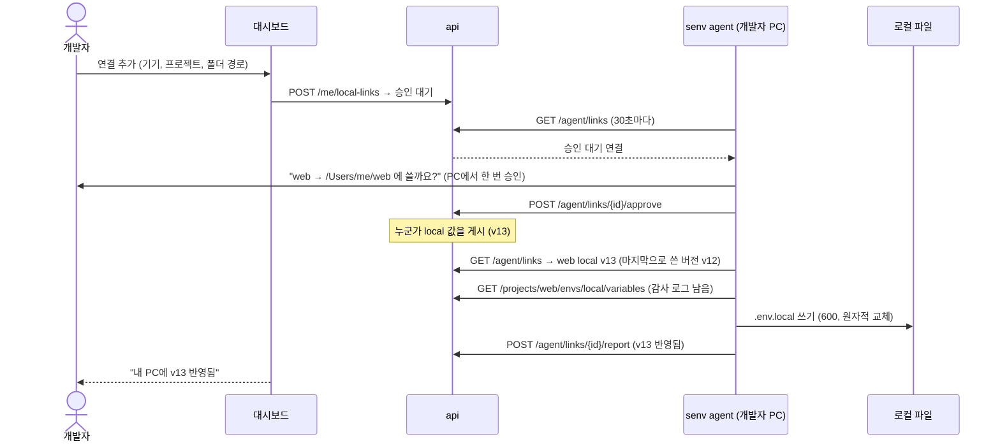

# 계획: 대시보드에서 로컬 `.env` 자동 받기

- 상태: 결정됨 (2026-10-08, PRD 결정 60~64). 7장의 권장안을 모두 채택했다
- 작성: 2026-10-08
- 관련: PRD 6장(CLI), 7장(대시보드), 9장(보안), 결정 28·49

## 1. 요구

> 대시보드에서 계정별로, local 환경은 파일 경로를 입력해 두면 `.env` 파일을 자동으로 받아오게 할 수 있나?

풀어 쓰면 다음과 같다.

1. 사용자가 **대시보드**에서 "이 프로젝트의 local 값은 내 PC의 이 경로에 둔다"를 등록한다.
2. local 값이 게시되면 그 경로의 파일이 **자동으로** 최신 값으로 바뀐다. 매번 `senv pull`을 칠 필요가 없다.
3. 등록은 **계정별**이다. 같은 계정이라도 PC마다 경로가 다를 수 있다.

## 2. 핵심 제약: 브라우저는 입력한 경로에 파일을 쓸 수 없다

웹 페이지는 보안상 사용자가 입력한 로컬 경로(`/Users/me/repo/.env.local`)에 파일을 쓸 수 없다. 방법은 둘뿐이다.

| 방법 | 경로 입력 | 자동 반영 | 지원 범위 | 파일 보호 (600, gitignore 확인) |
| --- | --- | --- | --- | --- |
| **A. 로컬 에이전트**: 대시보드에서 경로를 등록하고, PC에서 도는 `senv agent`가 실제로 쓴다 | 가능 (문자열 입력) | 가능 (탭을 닫아도) | CLI가 도는 모든 OS | 가능 (기존 `pull`과 같은 코드) |
| **B. 브라우저 직접 쓰기**: File System Access API로 폴더를 고르면 그 폴더에 쓴다 | 불가 (OS 폴더 선택 창만 가능, 페이지는 전체 경로를 알 수 없음) | 대시보드 탭이 열려 있을 때만 | Chrome·Edge 계열만 (Safari·Firefox 불가) | 불가 (권한 600 지정 불가, `git check-ignore` 불가) |

요구 1~3을 모두 만족하는 것은 **A**뿐이다. B는 설치 없이 쓸 수 있다는 장점만 있고, 경로 입력·탭 없이 자동 반영·파일 보호가 모두 안 된다.

**권장: A (로컬 에이전트)**. 개발자는 `senv run`을 쓰려고 이미 CLI를 설치하므로 추가 설치 부담이 작다.

## 3. 전체 구조 (A안)

### 3.1 용어

- **기기**: `senv agent`가 처음 실행될 때 서버에 등록하는 PC. 이름은 호스트 이름이다. 기기 ID는 CLI 설정 폴더에 저장한다.
- **로컬 연결**: (사용자, 기기, 프로젝트, 폴더 경로) 한 묶음. 환경은 `local`로 고정한다.

### 3.2 경로 규칙

사용자는 **프로젝트 폴더**(`senv.json`이 있는 폴더) 경로를 입력한다. 파일 이름은 그 폴더의 `senv.json`의 `output`(기본 `.env.local`)을 따른다. 그래서 `senv pull`과 같은 파일에 쓰고, 둘을 섞어 써도 결과가 같다.

## 4. 보안 설계

서버가 "이 경로에 써라"를 지시하는 구조라서, **대시보드 세션이 탈취되면 에이전트가 임의의 파일을 덮어쓰게 되는 것**이 가장 큰 위험이다. 예를 들어 `~/.zshrc`를 덮어써 코드를 실행시킬 수 있다. 그래서 신뢰 경계는 서버가 아니라 **에이전트**에 둔다.

| 위협 | 대응 (에이전트가 검사) |
| --- | --- |
| 대시보드에서 임의 경로 등록 | 새 연결과 경로 변경은 **PC에서 한 번 승인**해야 쓴다. 승인 API는 CLI 토큰으로만 부를 수 있고 대시보드 세션으로는 부를 수 없다 |
| 프로젝트 폴더가 아닌 곳에 쓰기 | 경로를 `realpath`로 푼 뒤 그 폴더에 `senv.json`이 있고 `project`가 연결과 같을 때만 쓴다 |
| 심볼릭 링크로 폴더 밖에 쓰기 | 출력 파일이 심볼릭 링크면 쓰지 않는다. `output` 규칙(상대 경로, 폴더 안)은 기존 `senv.json` 검증을 그대로 쓴다 |
| 값이 커밋됨 | 출력 파일이 git에서 무시되지 않으면 쓰지 않는다 (`pull`의 `isGitIgnored`). `--force` 같은 우회는 없다 |
| 공개 접두사 시크릿 | `pull`과 같은 노출 검사. 걸리면 쓰지 않고 오류로 보고한다 |
| 다른 사람의 PC에 쓰기 | 연결은 소유자만 보고 만든다. 에이전트는 자기 계정의 연결만 받는다 |

그 밖에 지킬 것:

- **파일 보호**: 권한 600, 같은 폴더의 임시 파일에 쓴 뒤 이름을 바꾼다(원자적 교체). 개발 서버가 반쯤 쓴 파일을 읽지 않게 하기 위해서다.
- **로컬 수정 보호**: 마지막으로 쓴 내용의 해시를 기억해 둔다. 파일이 그 뒤에 직접 고쳐졌으면 덮어쓰지 않고 "로컬에서 수정됨"으로 보고한다. 대시보드에서 "덮어쓰기"를 누르면 그때 쓴다. 개인 값은 M2의 `.env.local.override`로 옮기도록 안내한다.
- **토큰**: 에이전트는 CLI가 키체인에 저장한 토큰을 같이 쓴다. 갱신은 이미 파일 잠금으로 한 프로세스만 하므로, 서버의 refresh 재사용 감지에 걸리지 않는다 (`apps/cli/src/auth/session.ts`).
- **감사 로그**: 값 조회는 기존 전달 API를 그대로 써서 감사 로그에 남는다. 기기 이름을 함께 남긴다.
- **범위**: local 환경만. development·production은 다루지 않는다. M2 권한이 들어오면 local `read` 권한이 있어야 한다.

## 5. 변경 범위

### 5.1 서버 (`apps/server`)

**데이터 (Prisma 마이그레이션 1개)**

| 테이블 | 열 |
| --- | --- |
| `devices` | id, user_id, name, created_at, last_seen_at |
| `local_links` | id, user_id, device_id, project_id, path(1024), status(`pending`·`active`·`paused`), approved_at, last_written_version, last_written_shared_version, last_written_at, last_state(`ok`·`not_ignored`·`no_config`·`project_mismatch`·`modified`·`exposure`·`error`), last_state_at, overwrite_requested_at, created_at, updated_at. 유일 키 (device_id, path) |

**대시보드용 API (세션, 본인 것만)**

| 메서드 | 경로 | 동작 |
| --- | --- | --- |
| GET | `/api/v1/me/devices` | 내 기기 목록 (마지막 접속) |
| DELETE | `/api/v1/me/devices/{id}` | 기기와 그 연결 삭제 |
| GET | `/api/v1/me/local-links` | 내 로컬 연결과 상태 |
| POST | `/api/v1/me/local-links` | 연결 추가 → `pending` |
| PATCH | `/api/v1/me/local-links/{id}` | 일시정지·재개. 경로를 바꾸면 다시 `pending` |
| DELETE | `/api/v1/me/local-links/{id}` | 연결 삭제 (파일은 지우지 않는다) |
| POST | `/api/v1/me/local-links/{id}/overwrite` | "로컬에서 수정됨"인 파일을 다음 주기에 덮어쓰게 표시 |

**에이전트용 API (CLI 토큰만)**

| 메서드 | 경로 | 동작 |
| --- | --- | --- |
| POST | `/api/v1/agent/devices` | 기기 등록 (이름 → id) |
| GET | `/api/v1/agent/links?device={id}` | 이 기기의 연결과 각 프로젝트의 현재 local 버전·공유 버전. 부를 때마다 `last_seen_at` 갱신 |
| POST | `/api/v1/agent/links/{id}/approve` | PC에서 승인 → `active` |
| POST | `/api/v1/agent/links/{id}/report` | 결과 보고 (버전, 상태) |

변경 감지는 **30초 폴링**으로 시작한다. 응답이 작고(연결 수 × 버전 번호) 개발용 local 값이라 30초 지연은 문제가 없다. 지연을 줄여야 하면 같은 API를 롱폴링으로 바꾼다.

### 5.2 CLI (`apps/cli`)

| 명령 | 동작 |
| --- | --- |
| `senv agent [--interval 30]` | 포그라운드로 돌며 연결을 확인하고 파일을 쓴다. 터미널이면 승인 대기 연결을 그 자리에서 물어본다 |
| `senv agent install` / `uninstall` / `status` | 로그인할 때 자동으로 시작하도록 등록한다. macOS `launchd`(LaunchAgents)와 Linux `systemd --user`를 먼저 하고, Windows는 나중에 |
| `senv link list` | 이 기기의 연결과 상태 |
| `senv link approve <id>` / `reject <id>` | 승인 대기 연결 처리 (`install`로 돌 때는 터미널이 없으므로 이것으로 승인) |
| `senv link add` | 지금 폴더를 바로 연결한다. PC에서 시작했으니 승인이 필요 없다 |

구현 메모:

- `pull`에서 파일 쓰기 부분(머리글, 600, gitignore 확인, 노출 검사)을 함수로 빼서 `pull`과 에이전트가 함께 쓴다.
- 쓸지 판단: 서버의 현재 (버전, 공유 버전)이 마지막으로 쓴 것과 다르거나 덮어쓰기 요청이 있으면 쓴다.
- 기기 ID는 CLI 설정 폴더의 `device.json`에 둔다. 로그아웃해도 남기고, `senv agent uninstall`할 때 지운다.

### 5.3 대시보드 (`apps/dashboard`)

- **사용자 메뉴 → "내 로컬 연결"** (`/me/local`)
  - 기기 목록: 이름, 마지막 접속(1분 안이면 "실행 중").
  - 연결 표: 프로젝트, 경로 → 실제 파일, 상태 배지(승인 대기 / vN 반영됨 / 로컬에서 수정됨 / gitignore 안 됨 / 일시정지 등), 동작(덮어쓰기, 일시정지, 경로 수정, 삭제).
  - "연결 추가" 대화상자: 기기, 프로젝트(공유 그룹 제외), 폴더 경로. 기기가 없으면 `senv agent install` 안내를 보여준다.
- **프로젝트 화면 local 열**: 내 연결이 있으면 "내 PC: v12 반영됨" 또는 "v13 반영 대기"를 작게 표시한다.
- 목업 모드에 가짜 기기와 연결을 넣는다.

## 6. 진행 순서 (TDD, 단계마다 verify 통과 후 커밋)

1. **core**: 상태 판단 순수 함수 (버전 비교, 쓸지 여부, 로컬 수정 감지). 단위 테스트.
2. **서버 데이터·서비스**: 마이그레이션, `DevicesService`·`LocalLinksService`. 소유자 검사, 경로 변경 시 `pending` 복귀, 승인은 토큰 인증만. Testcontainers 통합 테스트.
3. **서버 API**: 두 컨트롤러, OpenAPI 갱신, 계약 테스트 경로 목록 갱신.
4. **CLI 파일 쓰기 분리**: `pull` 동작이 그대로인지 기존 테스트로 확인하며 리팩터링.
5. **CLI 에이전트**: 가짜 API와 임시 폴더로 테스트한다. 승인, 경로 검증(`senv.json` 없음, 프로젝트 다름, 심볼릭 링크, gitignore 안 됨), 로컬 수정 보호, 원자적 쓰기, 노출 검사.
6. **CLI 등록 명령**: `agent install`이 만드는 plist·unit 파일 내용 테스트. 실제 `launchctl`·`systemctl` 호출은 주입해서 가짜로 바꾼다.
7. **대시보드**: "내 로컬 연결" 화면과 프로젝트 local 열 표시. Testing Library 테스트, 목업 모드.
8. **e2e**: 실제 서버 + 에이전트 한 주기. 게시 → 파일에 새 값이 써지는지.
9. **PRD**: 결정 기록, 6.2 명령 표, 7.1 화면 표, 9장 위협, 로드맵 단계.

크기 감: 서버와 CLI 에이전트가 각각 중간 규모이고, 대시보드는 작은 편이다. M1의 배포 대상 연동보다는 훨씬 작다.

## 7. 결정

모두 권장안으로 정했다 (PRD 결정 60~64).

| # | 질문 | 결정 | 고르지 않은 선택지 |
| --- | --- | --- | --- |
| 1 | 방식 | A. 로컬 에이전트 | B. 브라우저 직접 쓰기 (Chrome 계열, 탭 열려 있을 때만), A+B 둘 다 |
| 2 | 대시보드에서 등록한 경로를 언제부터 쓰나 | PC에서 한 번 승인한 뒤 | 승인 없이 바로 (세션 탈취 시 임의 파일 덮어쓰기 위험), CLI에서만 등록하고 대시보드는 켜고 끄기만 |
| 3 | 파일을 직접 고쳤으면 | 덮어쓰지 않고 "로컬에서 수정됨" 표시 | 항상 덮어쓰기 (`pull`과 같음) |
| 4 | 변경 감지 | 30초 폴링 | 롱폴링·SSE (지연 수 초, 서버 연결 유지 부담) |
| 5 | 단계 | M1 배포가 안정된 뒤 M2 앞에 (M1.1) | M2에 포함, M4 (`senv sync`와 함께) |

## 8. 하지 않는 것

- development·production 자동 받기. 서버에 닿는 값이 많아지고 PC에 운영 값이 파일로 남는다.
- 대시보드의 `.env` 다운로드 버튼. 경로를 고를 수 없고, 다운로드 폴더에 값 파일이 남으며, gitignore 확인을 할 수 없다. 필요하면 따로 결정한다.
- 개인 덮어쓰기 파일(`.env.local.override`)은 M2 항목 그대로 둔다. 이 계획은 그 파일을 건드리지 않는다.
